```{r setup, include=FALSE, cache=FALSE}
# set working directory to docs folder
# setwd(here::here("docs"))

# Set global R options
options(htmltools.dir.version = FALSE, servr.daemon = TRUE)

# Set global knitr chunk options
knitr::opts_chunk$set(
  fig.align = "center", 
  cache = TRUE,
  error = FALSE,
  message = FALSE, 
  warning = FALSE, 
  collapse = TRUE 
)

library(tidyverse)
# This is good for getting the ggplot background consistent with
# the html background color
library(ggplot2)
thm <- theme_bw()
theme_set(thm)
```

```{r, echo=FALSE}
# Configurando reticulate
library(reticulate)
reticulate::use_python("/home/felipe/miniconda3/bin/python")
```

class: title-slide   
<a href="https://github.com/dataAt/intro-analise-de-dados-apresentacao" class="github-corner" aria-label="Código no Github"><svg width="80" height="80" viewBox="0 0 250 250" style="fill:#fff; color:#151513; position: absolute; top: 0; border: 0; right: 0;" aria-hidden="true"><path d="M0,0 L115,115 L130,115 L142,142 L250,250 L250,0 Z"></path><path d="M128.3,109.0 C113.8,99.7 119.0,89.6 119.0,89.6 C122.0,82.7 120.5,78.6 120.5,78.6 C119.2,72.0 123.4,76.3 123.4,76.3 C127.3,80.9 125.5,87.3 125.5,87.3 C122.9,97.6 130.6,101.9 134.4,103.2" fill="currentColor" style="transform-origin: 130px 106px;" class="octo-arm"></path><path d="M115.0,115.0 C114.9,115.1 118.7,116.5 119.8,115.4 L133.7,101.6 C136.9,99.2 139.9,98.4 142.2,98.6 C133.8,88.0 127.5,74.4 143.8,58.0 C148.5,53.4 154.0,51.2 159.7,51.0 C160.3,49.4 163.2,43.6 171.4,40.1 C171.4,40.1 176.1,42.5 178.8,56.2 C183.1,58.6 187.2,61.8 190.9,65.4 C194.5,69.0 197.7,73.2 200.1,77.6 C213.8,80.2 216.3,84.9 216.3,84.9 C212.7,93.1 206.9,96.0 205.4,96.6 C205.1,102.4 203.0,107.8 198.3,112.5 C181.9,128.9 168.3,122.5 157.7,114.1 C157.9,116.9 156.7,120.9 152.7,124.9 L141.0,136.5 C139.8,137.7 141.6,141.9 141.8,141.8 Z" fill="currentColor" class="octo-body"></path></svg></a><style>.github-corner:hover .octo-arm{animation:octocat-wave 560ms ease-in-out}@keyframes octocat-wave{0%,100%{transform:rotate(0)}20%,60%{transform:rotate(-25deg)}40%,80%{transform:rotate(10deg)}}@media (max-width:500px){.github-corner:hover .octo-arm{animation:none}.github-corner .octo-arm{animation:octocat-wave 560ms ease-in-out}}</style>

<br><br><br><br>
# .font200[Introdução à análise de dados] 

<br><br>
### Adriano Pereira, Felipe Carvalho & Felipe Menino
### Julho 2021

---
# Agenda

<br><br>


- .font120[<s>Introdução ao R</s> `r anicon::faa("r-project", animate = 'float', speed = 'slow', color = 'steelblue')`]

  - .font120[<s>Tidyverse</s> `r anicon::cia("./images/2_r_img/logo_tidyverse_menor.png", animate = 'float', speed = 'slow')`]

- .font120[Introdução ao Python `r anicon::faa("python", animate = 'float', speed = 'slow')`]

  - .font120[Pandas `r anicon::cia("./images/python/pandas-logo-300.png",  animate = 'float', speed = 'slow')`]

- .font120[Visualização de dados `r anicon::cia("./images/2_r_img/ggplot2_logo_menor.jpeg", animate = 'float', speed = 'slow')`]

<br>

<!-- Inicio da parte de Python-->
---

class: title-slide

<br><br><br><br>
# .center.font170[Introdução ao Python `r anicon::faa("python", animate = 'float', speed = 'slow')`]
---
# Introdução ao Python

<br><br><br>
.font150[
Python é uma linguagem de programação multiparadigma, que através de uma sintaxe simples, permite a seus utilizadores focar na solução de problemas, não os impedindo com complexidades além do necessário.
]

<br><br>

---
class: title-slide

<br><br><br><br>
# .center[.font170[Conceitos básicos da linguagem]]

---
# Comandos básicos da linguagem

.pull-left[
  #### Declarações de variáveis
  
  A declaração de variáveis no Python é feita com o sinal .bold[=]
  
  ```
  variavel = valor da variável
  ```
  
  Os valores das variáveis podem ser de diferentes tipos:

  ```{python}
  inteiro = 123
  flutuante = 1.1234
  booleano = True
  lista = [1, 2, 3, 4, 5]
  dicionario = {'chave': 'valor'}
  string = 'Um texto legal'
  ```
]

.pull-right[
  #### Manipulação de números (Inteiro e Float)
  
  ```{python, eval = FALSE}
  inteiro + 2 # 125
  
  inteiro * 2 # 246
  
  flutuante / 2 # 0.5617
  ```
  
  #### Manipulação de listas

  ```{python, eval = FALSE}
  lista[0] # 1 (Primeiro valor)
  
  lista[0:3] # Do valor `0` à `2`
  
  lista[-1] # Último valor
  ```
  
  #### Manipulação de dicionário (Chave-Valor)
  
  ```{python, eval = FALSE}
  dicionario['chave'] # 'valor'
  ```
]

---
# Estrutura de controle de decisão

.font130[
As estruturas de controle de decisão são utilizadas para determinar quais ações/códigos serão executados com base na verificação de testes lógicos.
]

.pull-left[
**if**

```{python}
if (2 > 1):
  print("Dois é maior que um!")
```

**else**

```{python}
if (2 < 1):
  print('Dois é menor que um')
else:
  print('Dois é maior que um')
```
]

.pull-right[

<br>

**elif**

```{python}
if (1 > 1):
  print('Um é maior que um')
elif(1 > 0.5):
  print('Um é maior que meio')
```
]

---
# Estrutura de repetição

.font130[
Estruturas de repetição permitem que um determinado bloco de código seja executado por diversas vezes.
]

.pull-left[
  **Iterando com testes lógicos (while)**
  
  ```{python}
  i = 0
  while i < 5:
    print(i)
    i += 1
  ```
]

<div style="position: relative; top: -70px">
.pull-right[
  **Iterando em elementos (for-each)**

  Iterando em uma lista de valores:
  ```{python, eval = FALSE}
    for i in [11, 22]:
      print(i)
    
    # 1° Iteração (i = 11)
    # 2° Iteração (i = 22)
  ```

  Iterando em um intervalo de valores:
  ```{python, eval = FALSE}
    for i in range(0, 9, 3): # range(inicio, fim, passo)
      print(i)
  
    # 1° Iteração (i = 0)
    # 2° Iteração (i = 3)
    # 3° Iteração (i = 6)
  ```
]
</div>

---
class: title-slide

<br><br><br><br>
# .center[.font170[Pandas] `r emo::ji("panda_face")`] 

---
# Pandas `r emo::ji("panda_face")`

<br>
.font130[
Pandas é uma biblioteca para a linguagem de programação Python, que fornece recursos rápidos, poderosos, flexíveis e .bold[fáceis de usar] para a manipulação e análise de dados.
]

<br>

.bold[Para importar a biblioteca, utilize:]

```{python}
import pandas as pd
```

> Para instalar a biblioteca, utilize o comando `pip install pandas`

---
# Pandas `r emo::ji("panda_face")`

<br>

.center[.font160[.bold[Qual tipo de dado é possível manipular com `Pandas` ?]]]

<br>

.center[
.font130[
  As funcionalidades do `Pandas` ajudam na exploração, limpeza e processamento de dados tabulares, como os armazenados em planilhas Excel, CSV ou bancos de dados tabulares.
]
]

---
class: title-slide

<br><br><br><br>
# .center[.font160[Estruturas de dados] `r emo::ji("die")`]

---
# Estruturas de dados `r emo::ji("die")`

<br><br>
.pull-left[

.center[
.font200[`r anicon::cia("images/python/v2021/pandas_estruturas-de-dados_series.png", animate = 'float', speed = 'slow', size = 5)`]
]
.center[.font200[.bold[Series]]]
]

.pull-right[
.center[
.font200[`r anicon::cia("images/python/v2021/pandas_estruturas-de-dados_dataframes.png", animate = 'float', speed = 'slow', size = 5)`]
]
.center[.font200[.bold[DataFrames]]]
]

---
# Estruturas de dados `r emo::ji("die")`

.center[
.font150[.bold[Series] são estruturas de dados unidimensionais que permitem o armazenamento de sequências de valores.]
]


<div style = "position:relative; left: 190px; top: -20px; width: 70%">
  </img>
</div>

---
# Estruturas de dados `r emo::ji("die")`

.center[
.font140[Cada uma das linhas são associadas a .bold[nomes] (ou índices), que podem ser utilizados para a busca e recuperação dos dados.]
]

<div style = "position:relative; left: 190px; top: -20px; width: 70%">
  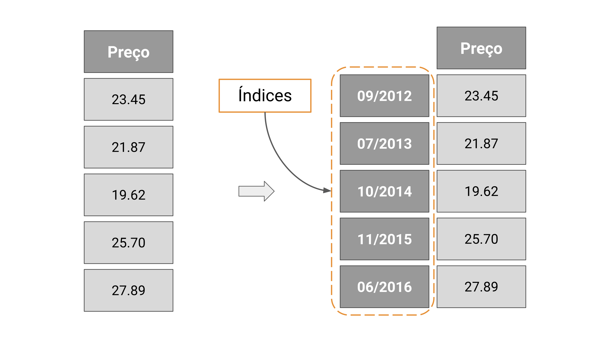</img>
</div>

---
# Estruturas de dados `r emo::ji("die")`

.center[
.font140[Diferentes tipos de dados podem ser armazenados] .font100[(e.g. Inteiro, String, Float)] .font140[e utilizados para a criação dos índices de uma `Series`.]
]

<div style = "position:relative; left: 150px; top: -20px; width: 70%">
  </img>
</div>

---
# Estruturas de dados `r emo::ji("die")`

.center[
.font140[Diferentes tipos de dados podem ser armazenados] .font100[(e.g. Inteiro, String, Float)] .font140[e utilizados para a criação dos índices de uma `Series`.]
]

<div style = "position:relative; left: 150px; top: -20px; width: 70%">
  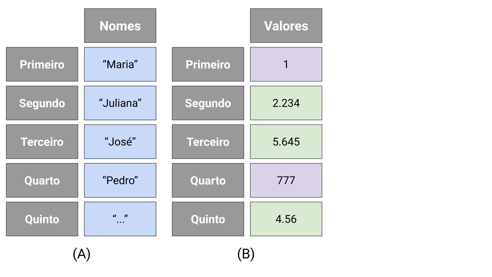</img>
</div>

---
# Estruturas de dados `r emo::ji("die")`

.center[
.font140[Diferentes tipos de dados podem ser armazenados] .font100[(e.g. Inteiro, String, Float)] .font140[e utilizados para a criação dos índices de uma `Series`.]
]

<div style = "position:relative; left: 150px; top: -20px; width: 70%">
  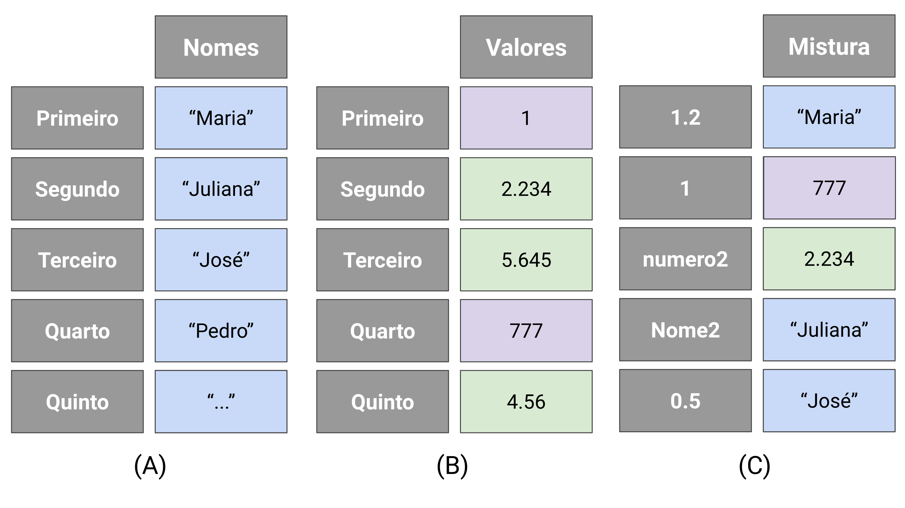</img>
</div>

---
# Estruturas de dados `r emo::ji("die")`

.center[
.content-box-gray[.bold[Exemplos de manipulação das Series]]
]

.pull-left[
  #### Criando uma `Series`
  ```{python}
  series = pd.Series([1, 2]) 
  print(series)
  ```
  
  #### `Series` com índice
  ```{python}
  series = pd.Series([1, 2, 3], 
                     index = [9, 'ultimo', 'tres'])
  print(series)
  ```
]

<div style="position: relative; top: -30px">
.pull-right[
  #### Recuperando dados

  Pode-se recuperar os dados com o operador .bold[[]]
  
  ```
  serie[nome da linha]
  ```
  
  Recuperação de uma linha única:
  
  ```{python}
  series[9]
  ```

  Intervalos de valores também são permitidos:

  ```{python}
  series[9: 'tres']
  ```
]
</div>

---
# .font70[.bold[Exemplo de utilização]: Trajetória de uso e cobertura da Terra (LULC).]

.center[
  Trajetória: Variação temporal de classes de LULC de uma coleção de dados em uma determinada localização no espaço geográfico.
]

.pull-left[
  <!-- .center.bold[Criando a trajetória como uma `Series`] -->
  #### Criando a trajetória como uma `Series`

  ```{python}
  trajectory = pd.Series([
    "Pastagem", "Pastagem", 
    "Outras Lavouras Temporárias", 
    "Soja", "Soja"
  ], index = [2014, 2015, 2016, 2017, 2018])
  
  trajectory
  ```
  
  .bold.center.font50[
    Trajetória extraída da localização (-10.710, -55.612) com o serviço <a href="https://github.com/brazil-data-cube/wlts">WLTS</a> (Coleção MapBiomas 5).
  ]
]

.pull-right[
  <!-- .center.bold[Mais formas de acessar os dados] -->
  #### Mais formas de acessar os dados
  
  Recuperando os primeiros valores com `head`
  
  ```{python}
  trajectory.head(n = 2) # padrão (n = 5)
  ```
  
  Recuperando os últimos valores com `tail`
  
  ```{python}
  trajectory.tail(n = 2)
  ```
]

---
# Estruturas de dados `r emo::ji("die")`

.center[
.content-box-gray[.bold[Questão]: Como tratar os casos em que há mais colunas ?]
]

<div style = "position:relative; left: 100px; top: -5px; width: 80%">
  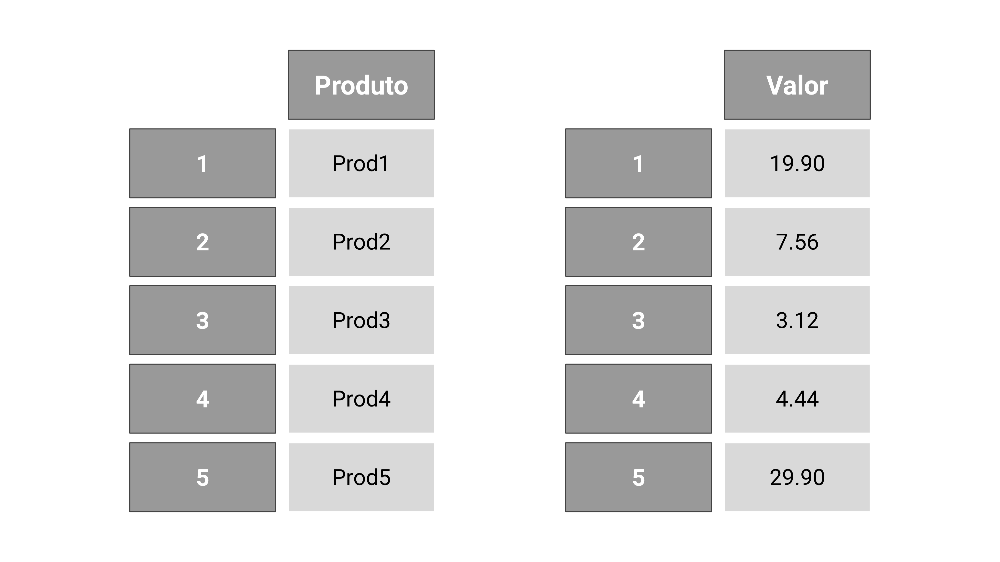</img>
</div>

---
# Estruturas de dados `r emo::ji("die")`

.center[
.content-box-gray[.bold[Questão]: Como tratar os casos em que há mais colunas ?]
]

<div style = "position:relative; left: 100px; top: -5px; width: 80%">
  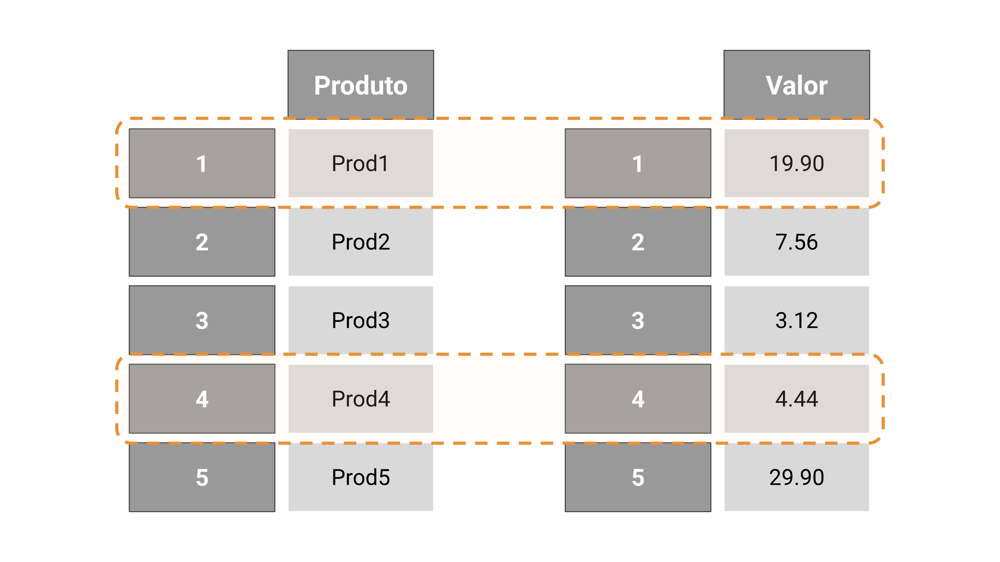</img>
</div>

---
# Estruturas de dados `r emo::ji("die")`

.center[
.font130[.bold[DataFrames] são estruturas de dados bidimensionais, representando tabelas, formadas por conjuntos de Series. É a estrutura de dados principal do Pandas.
]]

<div style = "position:relative; left: 120px; top: -5px; width: 77%">
  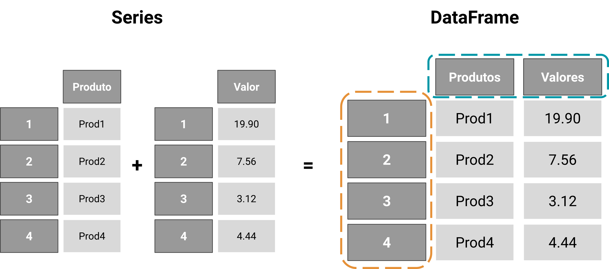</img>
</div>

---
# Estruturas de dados `r emo::ji("die")`

.center[
  .content-box-gray[.bold[Exemplo de manipulação dos DataFrames]]
]

.pull-left[
  #### Criando um DataFrame
  
  ```{python}
  df = pd.DataFrame([[1, 2, 3, 4], [11, 12, 13, 14]])
  print(df)
  ```
  
  #### DataFrame com índice
  ```{python}
  df = pd.DataFrame([[1, 2, 3, 4], [11, 12, 13, 14]], 
                      index = ['um', 'dois'])
  print(df)
  ```
]

<div style="position: relative; top: 80px">
.pull-right[
  #### Índices e colunas
  
  ```{python}
  df = pd.DataFrame([[1, 2, 3, 4], [11, 12, 13, 14]], 
                    index = ['um', 'dois'], 
                    columns = ['a', 'b', 'c', 'd'])
  print(df)
  ```
]
</div>

---
# Estruturas de dados `r emo::ji("die")`

.center[
  .content-box-gray[.bold[Exemplo de manipulação dos DataFrames]]
]

.pull-left[

  #### Recuperando dados
  
  Como as `Series`, nos `DataFrames` a recuperação básica de dados ocorre com o operador .bold[[]].
  
  ```
  dataframe[nome da coluna]
  ```

  #### DataFrame de exemplo
  ```{python}
  df = pd.DataFrame([[1, 2, 3, 4], [11, 12, 13, 14]], 
                  index = ['um', 'dois'], 
                  columns = ['a', 'b', 'c', 'd'])
  print(df)
  ```
]

<div style="position: relative; top: 30px">
.pull-right[
  #### Recuperando uma coluna
  
  ```{python}
  df['a'] # <class 'pandas.core.series.Series'>
  ```
  
  #### Recuperando mais colunas
  
  ```{python}
  df[['a', 'b']] # <class 'pandas.core.frame.DataFrame'>
  ```
]
</div>

---
# .font70[.bold[Exemplo de utilização]: Séries temporais de imagens de satélite (SITS).]

.center[
  SITS: Variação temporal de valores de bandas espectrais em uma determinada localização no espaço geográfico.
]

.pull-left[
  .center.bold[`DataFrame` com SITS de vários pontos]

  ```{python}
  sits = pd.DataFrame({
    "P1_NDVI": [0.578, 0.653, 0.691, 0.451], # Ponto 1
    "P2_NDVI": [0.592, 0.617, 0.580, 0.578], # Ponto 2
    "P3_NDVI": [0.574, 0.591, 0.570, 0.385]  # Ponto 3
  }, index = ["2017-01-01", "2017-01-17", 
              "2017-02-02", "2017-02-18"])
  
  sits
  ```
  
  .bold.center.font50[
    SITS extraídas com o serviço <a href="https://github.com/brazil-data-cube/wtss.py">WTSS</a> (Coverage CBERS-4/AWFI).
  ]
]

<div style="position: relative; top: 40px">
.pull-right[
  .center[Visão geral dos dados com `describe`]
  
  ```{python}
  sits.describe() # Informações estatísticas
  ```
]
</div>

---
class: title-slide

<br><br><br><br>
# .center.font140[Seleção e filtro de dados com Pandas]

<!-- No slide após este, inserir uma figura mostrando o processo de manipulação dos dados. (Pegando de uma tabela completa e entendendo somente uma parte, filtro e etc...) -->

---
# Seleção e filtro de dados com Pandas

.font120[Durante o processo de análise, faz-se necessário a realização de seleção e filtro dos dados para a captura de comportamentos específicos. O Pandas fornece diferentes métodos para essas operações.]

<!-- > No `Pandas` estão disponíveis [diferentes métodos](https://pandas.pydata.org/pandas-docs/stable/user_guide/indexing.html#indexing-and-selecting-data) para essas operações. -->

--
## loc e iloc

Dentre os métodos disponíveis, tem-se o .bold[loc] e o .bold[iloc] que permitem a seleção e filtro de dados armazenados em `Series` e `DataFrames`.

<br>
.center[
  | Series                    |           DataFrames                        |
  |---------------------------|---------------------------------------------|
  |  \.loc[Nome da linha]     | \.loc[Nome da linha,  Nome da coluna]       |
  |  \.iloc[Posição da linha] | \.iloc[posição da linha, posição da coluna] |
]

---
# Seleção e filtro de dados com Pandas

.center[
  .content-box-gray[.bold[Exemplo de utilização do loc]]
]

<div style="position: relative; top: 50px">
.pull-left[
  #### DataFrame de exemplo
  
  ```{python}
  df = pd.DataFrame({
    'nome': ['Joana', 'Maria', 'Josefa'],
    'idade': [15, 18, 21],
    'nota': [8, 9, 10]
  }, index = [7, 8, 9])
  
  df
  ```
]
</div>

.pull-right[
  #### Selecionando dados pelo `nome` das linhas e colunas

  Recuperando a linha de `nome` "9"
  
  ```{python}
  print(df.loc[9])
  ```

  Recuperando a linha de `nome` "9" e a coluna de `nome` "idade"
  
  ```{python}
  print(df.loc[9, 'idade'])
  ```
]

---
# Seleção e filtro de dados com Pandas

.center[
  .content-box-gray[.bold[Exemplo de utilização do iloc]]
]

<div style="position: relative; top: 50px">
.pull-left[
  #### DataFrame de exemplo
  
  ```{python}
  df = pd.DataFrame({
    'nome': ['Joana', 'Maria', 'Josefa'],
    'idade': [15, 18, 21],
    'nota': [8, 9, 10]
  }, index = [7, 8, 9])
  
  df
  ```
]
</div>

.pull-right[
  #### Selecionando dados pela `posição` das linhas e colunas

  Recuperando a linha de `posição` "2"
  
  ```{python}
  print(df.iloc[2])
  ```

  Recuperando a linha de `posição` "2" e a coluna de `posição` "2"
  
  ```{python}
  print(df.iloc[2, 2])
  ```
]

---
# Seleção e filtro de dados com Pandas

.center[
  .content-box-gray[.bold[Comparação entre loc e iloc]]
]

<div style="position: relative; top: 50px">
.pull-left[
  #### DataFrame de exemplo
  
  ```{python}
  df = pd.DataFrame({
    'nome': ['Joana', 'Maria', 'Josefa'],
    'idade': [15, 18, 21],
    'nota': [8, 9, 10]
  }, index = [7, 8, 9])
  
  df
  ```
]
</div>

.pull-right[
  #### Selecionando dados pela `posição` e `nome`

  Recuperando a linha de `nome` "9" com .bold[loc]
  
  ```{python}
  print(df.loc[9])
  ```

  Recuperando a linha de `posição` "2" com .bold[iloc]
  
  ```{python}
  print(df.iloc[2])
  ```
]

---
# Seleção e filtro de dados com Pandas

.center[
  .content-box-gray[.bold[Comparação entre loc e iloc]]
]

<div style="position: relative; top: 70px">
.pull-left[
  #### `DataFrame` com SITS de vários pontos

  ```{python}
  print(sits)
  ```
]
</div>

<div style="position: relative; top: -10px">
.pull-right[
  #### Selecionando dados com intervalos

  Recuperando intervalo de nomes das linhas
  
  ```{python}
  print(sits.loc["2017-01-01":"2017-01-17", "P2_NDVI"])
  ```

  Recuperando intervalo de posições das linhas
  
  ```{python}
  print(sits.iloc[0:2, 1])
  ```
]
</div>

---
# Seleção e filtro de dados com Pandas

.center[
  .content-box-gray[.bold[Filtro de dados]]
]

.pull-left[
  #### Indexação booleana

  É possível fazer o filtro de dados com um índice booleano

  ```{python}
  df = pd.DataFrame({
    'nome': ['A1', 'A2', 'A3', 'A4'], 
    'valor': [5, 12, 8, 30]
  })
  
  df
  ```
]

<div style="position: relative; top: 24px">
.pull-right[
  O filtro dos dados pode ser feito com .bold[loc] e .bold[iloc]
  
  #### loc
  
  ```{python}
  df.loc[[False, True, False, True]]
  ```
  
  #### iloc
  
  ```{python}
  df.iloc[[False, True, False, True]]
  ```
]
</div>

---
# Seleção e filtro de dados com Pandas

.center[
  .content-box-gray[.bold[Filtro de dados]]
]

.pull-left[
  #### Expressões booleanas
  
  Testes lógicos podem ser adicionados no filtro para a geração das listas booleanas
  
  ```
      dataframe.loc[(teste 1)]
  ```
  
  <br>
  Filtrando valores maiores que "5"
  ```{python}
  df.loc[df['valor'] > 5]
  ```
]

<div style="position: relative; top: 70px">
.pull-right[

  A expressão retorna os valores booleanos do teste feito
  ```{python}
  df['valor'] > 5
  ```
]
</div>

---
# Seleção e filtro de dados com Pandas

.center[
  .content-box-gray[.bold[Filtro de dados]]
]

.pull-left[
  #### Expressões booleanas mais `complexas`
  
  Mais testes lógicos podem ser adicionados ao filtro. Cada teste é separado por um operador lógico e parênteses.
  
  ```
      dataframe.loc[(teste 1) operador (teste 2)]
  ```
  
<br>
Os operadores lógicos são:
- **e** (`&`);
- **ou** (`|`).
]

<div style="position: relative; top: 45px">
.pull-right[

  Filtrando valores maiores ou igual a 5 **e** menores que 12
  ```{python}
  df.loc[(df['valor'] >= 5) & (df['valor'] < 12)]
  ```
  
  O método `query` pode ser mais amigável
  ```{python}
  df.query('valor >= 5 & valor < 12')
  ```
]

---
class: title-slide

<br><br><br><br>
# .center.font140[Agrupamento e agregação de dados]

---
# Agrupamento e agregação

<br><br><br>
.font130[
.bold[Agrupar] e .bold[agregar] são técnicas que facilitam a análise de dados. Em etapas exploratórias, essas operações podem ser essenciais para a identificação e entendimento de padrões nos dados.
]

---
# Agrupamento e agregação

<div style="position: relative; top: 40px">
.font130[
Agregações são operações aplicadas sobre os dados que resultam em conjuntos de valores. Esses valores podem variar em seu tipo de acordo com a estrutura de dados em que é aplicado.
]
</div>

<br><br>

.content-box-gray[.font120[.bold[Algumas funções de agregação]]] `r anicon::faa("hand-point-left", animate="horizontal")`

- .font120[sum()];
- .font120[max()];
- .font120[min()];
- .font120[mean()].


---
# Agrupamento e agregação

.center[
  .content-box-gray[.bold[Agregação de dados]]
]

<div style="position: relative; top: -50px">
.pull-left[
  ### `Series`

  ```{python}
  s = pd.Series([1, 2, 3])
  ```

  Calculando o somatório com `sum`
  ```{python}
  s.sum()
  ```

  Valor mínimo com `min`
  ```{python}
  s.min()
  ```
]
</div>

<div style="position: relative; top: -50px">
.pull-right[
  ### `DataFrames`

  ```{python}
  df = pd.DataFrame([[1, 2, 3], [4, 5, 6]])
  ```
  
  Calculando o valor médio com `mean`
  ```{python}
  df.mean()
  ```

  Valor máximo com `max`.
  ```{python}
  df.max()
  ```
]
</div>

---
# Agrupamento e agregação

.center[
  .content-box-gray[.bold[Agrupamento de dados]]
]

.pull-left[
  #### Agrupando dados com `groupby`
  
  É possível agrupar instâncias do conjunto de dados com base na igualdade de seus atributos.
  
  ```{python}
  df = pd.DataFrame({
    'nome': ['Tel1', 'Tel2', 'Tel3'],
    'tipo': ['antigo', 'novo', 'novo']
  })
  
  df
  ```
]

<div style="position: relative; top: 70px">
.pull-right[
  Agrupando pela coluna/atributo `tipo`
  
  ```{python}
  telefones_agrupados = df.groupby('tipo')
  ```

  </br>

  Recuperando os grupos gerados
  
  ```{python}
  telefones_agrupados.groups
  ```
]
</div>

---
class: title-slide

<br><br><br><br>
# .center[.font170[Agrupamento + Agregação = ] `r  anicon::faa("trophy", animate="tada")`]

---
# Agrupamento + Agregação

<br>

<div style = "position:relative; left: 120px; top: -5px; width: 77%">
  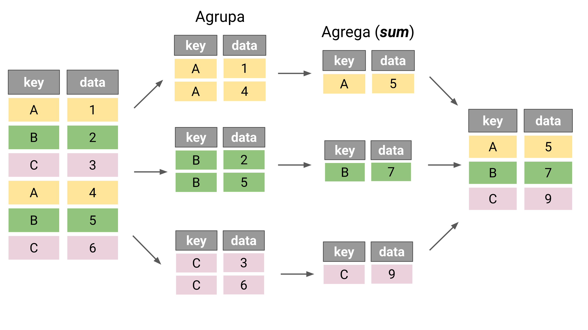</img>
</div>

---
# .font70[.bold[Exemplo de utilização]: Agrupando clientes.]


.pull-left[
  #### Definindo conjunto de dados sintético

  ```{python}
  df = pd.DataFrame({
    'nome': ['ana', 'maria', 'felipe', 'joão'],
    'idade': [19, 19, 20, 20],
    'dinheiro': [150, 150, 100, 100]
  })
  
  df
  ```
  
  Agrupando pela `idade`
  ```{python}
  agrupado = df.groupby('idade')
  ```
]

<div style="position: relative; top: 60px">
.pull-right[

  Agregando com `count` (Contando elementos)
  ```{python}
  print(agrupado.count())
  ```

  Agregando com `mean` (Média salarial por idade)
  
  ```{python}
  agrupado['dinheiro'].mean()
  ```
]
</div>

---
class: title-slide

<br><br><br><br>
# .center[.font170[Leitura e escrita de dados] `r  anicon::faa("book", animate="vertical")`]

---
# Leitura e escrita de dados

<div style="position: relative; top: 40px">
.font130[
Além das estruturas de dados e funcionalidades para a manipulação e processamento dos dados, o Pandas fornece ainda um conjunto de opções para a leitura e escrita de dados.
]
</div>

<br>

<div style = "position:relative; left: 80px; top: 30px; width: 85%">
    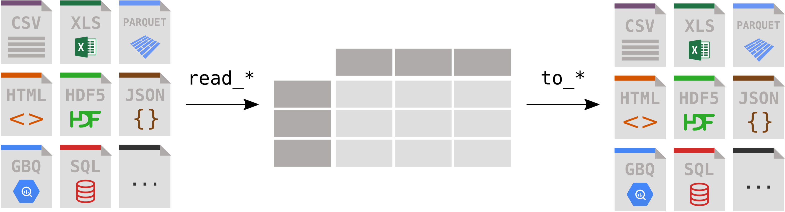</img>
</div>

<a href="https://pandas.pydata.org/pandas-docs/stable/user_guide/io.html#io-tools-text-csv-hdf5">.bold.center.font50[Lista de formatos e operações de leitura/escrita do Pandas]</a>

---
# .font70[.bold[Exemplo de utilização]: Leitura de dados CSV.]

.pull-left[
  #### Lendo e escrevendo dados `CSV`

  ```{python}
  data = pd.read_csv("data/titanic.csv", sep = ',')
  
  data.head(n = 3)
  ```
  
  Os dados carregados são representados por `Series` e `DataFrames`.

  ```{python, eval = FALSE}
  type(data)
  ```
  ```{python, echo=FALSE}
  str(type(data))
  ```
]

<div style="position: relative; top: 70px">
.pull-right[

  Verificando a quantidade de dados carregados com `shape`
  
  ```{python}
  data.shape  # (linhas, colunas)
  ```

  <br>

  Escrevendo os dados em um arquivo `CSV`

  ```{python}
  data.to_csv('data/resultados.csv')
  ```
]
</div>

---
class: title-slide
<br><br><br>

# .center.font170[Exemplo de análise de dados]


---
# .font70[.bold[Exemplo de análise]: Características de meteoritos.]

<div style="position: relative; top: -15px">
.font110[
Exemplo de análise de dados utilizando o conjunto de dados [Meteorite Landings](https://www.kaggle.com/nasa/meteorite-landings), disponibilizado no Kaggle pela NASA. O conjunto de dados é composto por mais de 45 mil registros, contendo diferentes informações sobre meteoritos que cairam na Terra.
]
</div>

<div style="position: relative; top: -35px">
.pull-left[
  #### Carregando os dados

  ```{python, eval = FALSE}
  import pandas as pd
  
  data = pd.read_csv("data/meteorite-landings.csv")
  type(data)
  ```
  
  ```{python, echo=FALSE}
  import pandas as pd
  
  data = pd.read_csv("data/meteorite-landings.csv")
  str(type(data))
  ```

  #### Verificando os atributos dos dados. 
  ```{python}
  data.columns
  ```
]
</div>

<div style="position: relative; top: -35px">
.pull-right[
  #### Separando os dados por tipo de meteorito
  
  ```{python}
  df_valid = data.loc[data['nametype'] == 'Valid']
  df_relict = data.loc[data['nametype'] == 'Relict']
  ```
  
  <br>
  
  #### Verificando as quantidades de cada tipo
  ```{python}
  print(df_valid.shape)
  ```
  
  ```{python}
  print(df_relict.shape)
  ```
]
</div>

---
# .font70[.bold[Exemplo de utilização]: Características de meteoritos.]

<div style="position: relative; top: -15px">
.pull-left[
  #### Verificando a massa média de cada tipo de meteorito
  
  ```{python}
  df_groupby_nametype = data.groupby('nametype')
  df_groupby_nametype['mass'].mean()
  ```
  
  #### Contando meteoritos por classe
  
  ```{python}
  df_groupedby_recclass = data.groupby('recclass')
  df_groupedby_recclass['recclass'].count().head(n = 3)
  ```
]
</div>

<div style="position: relative; top: 60px">
.pull-right[

  #### Filtrando os dados pela quantidade de `mass` (Gramas)
  
  ```{python}
  df_gt_mass_500 = data.loc[data['mass'] > 500]
  df_gt_mass_500.shape
  ```
  
  <br>
  
  #### Salvando os dados filtrados
  
  ```{python}
  df_gt_mass_500.to_csv('data/meteorite_gt_500_mass.csv')
  ```
]
</div>

---
class: title-slide

<br><br>

# .center[.font170[Visualização de dados] `r  anicon::faa("chart-bar", animate="tada")`]

---
# Pacotes de visualização

### As bibliotecas de visualização de dados `ggplot2` e `plotnine` são baseadas na obra .bold[The Grammar of Graphics], a qual apresenta uma grámatica para elaboração de gráficos. Tal gramática é composta por camadas, as quais descrevem os componentes do gráfico.

.pull-left[

.center.font110[Camadas de componentes gráficos]

```{r fig612, echo=FALSE, out.height="70%", out.width="70%"}
knitr::include_graphics("./images/2_r_img/ggplot-2.png")
```

]

--

.pull-right[

.center.font110[Sintaxe do ggplot/plotnine]

```{r, eval=FALSE}
   ggplot(data = <DATA>, aes(<MAPPINGS>)) + 
    <GEOM_FUNCTION>(
      mapping = aes(<MAPPINGS>),
      stat = <STAT>,
      position = <POSITION>) +
    <COORDINATE_FUNCTION> +
    <FACET_FUNCTION>
```

]

---
# Mapeamento estético

### A estética descreve cada aspecto de um dado elemento gráfico. Descrevemos as posições (`position`) por um valor x e y, mas outros sistemas de coordenadas são possíveis. É possível alterar a forma (`shape`), tamanho (`size`) e cor (`size`) dos elementos. 

.center[
```{r fig63, echo=FALSE, out.height="80%", out.width="80%"}
knitr::include_graphics("./images/2_r_img/aes_ggplot.png")
```
.center.font80[Fundamentals of Data Visualization - Claus O. Wilke]
]
---
# Objetos geométricos
.center[
```{r fig64, echo=FALSE, out.height="38%", out.width="38%"}
knitr::include_graphics("./images/2_r_img/ggplot.png")
```

.center.font60[Fundamentals of Data Visualization - Claus O. Wilke]
]

---
# .font70[.bold[Exemplo de visualização]: Biblioteca plotnine]

```{python, echo = FALSE}
from plotnine import *
from plotnine.options import set_option
from plotnine.data import mtcars, diamonds

_ = set_option('dpi', 300)

# easter egg (G ? 3 ? X ?)
import warnings
warnings.filterwarnings("ignore")

def save_ggplot_obj(obj, filename):
  """Save an p9.ggplot object on a file."""
  
  obj.save(filename = filename)
```

<div style="position: relative; top: 5px">

.pull-left[

#### Visualizando dados com plotnine

```{python}
from plotnine import *  # funções
from plotnine.data import mtcars # dados de exemplo

print(mtcars.head(n = 3))
```

#### Colunas do conjunto de dados
```{python}
mtcars.columns
```
]
</div>

--

<div style="position: relative; top: 5px">
.pull-right[

#### Definindo os dados do plot

```{python, eval = FALSE}
ggplot(mtcars)
```

```{python, echo = FALSE}
save_ggplot_obj(
  ggplot(mtcars), 
  './images/python/v2021/ggplot_1.png' 
)
```

```{r fig66, echo=FALSE, out.height="85%", out.width="85%"}

```
]
</div>

---
# .font70[.bold[Exemplo de visualização]: Biblioteca plotnine]

<div style="position: relative; top: 5px">
.pull-left[

#### Visualizando dados com plotnine

```{python}
from plotnine import *  # funções
from plotnine.data import mtcars # dados de exemplo

print(mtcars.head(n = 3))
```

#### Colunas do conjunto de dados
```{python}
mtcars.columns
```
]
</div>

<div style="position: relative; top: 5px">
.pull-right[

#### Mapeamento estético

```{python, eval = FALSE}
ggplot(mtcars, aes(x = 'mpg', y = 'disp'))
```

```{python, echo = FALSE}
save_ggplot_obj(
  ggplot(mtcars, aes(x = 'mpg', y = 'disp')), 
  './images/python/v2021/ggplot_2.png' 
)
```

```{r fig67, echo=FALSE, out.height="85%", out.width="85%"}
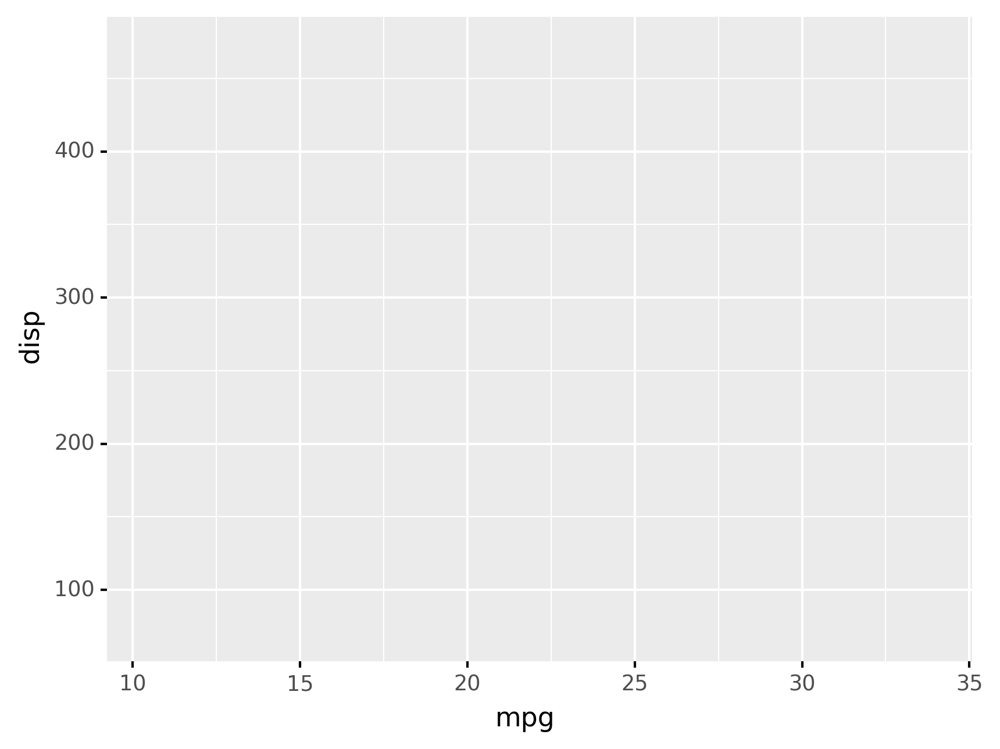
```
]
</div>

---
# .font70[.bold[Exemplo de visualização]: Biblioteca plotnine]

<div style="position: relative; top: 5px">
.pull-left[

#### Visualizando dados com plotnine

```{python}
from plotnine import *  # funções
from plotnine.data import mtcars # dados de exemplo

print(mtcars.head(n = 3))
```

#### Colunas do conjunto de dados
```{python}
mtcars.columns
```
]
</div>

<div style="position: relative; top: 5px">
.pull-right[

#### Adição de objeto geométrico

```{python, eval = FALSE}
(
  ggplot(mtcars, aes(x = 'mpg', y = 'disp'))
    + geom_point()
)
```

```{python, echo = FALSE}
save_ggplot_obj(
  (
    ggplot(mtcars, aes(x = 'mpg', y = 'disp'))
      + geom_point()
  ), 
  './images/python/v2021/ggplot_3.png' 
)
```

```{r fig68, echo=FALSE, out.height="85%", out.width="85%"}
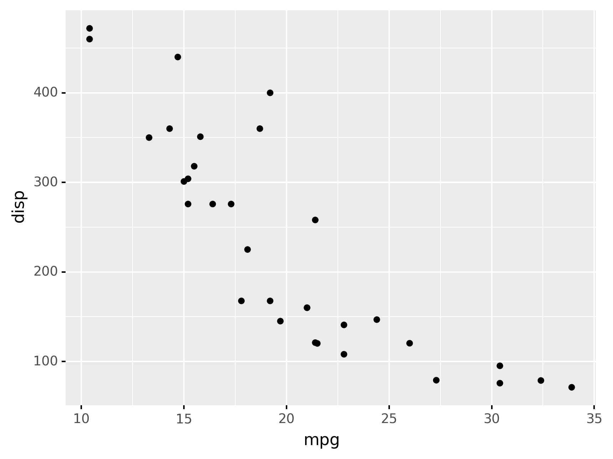
```
]
</div>

---
# .font70[.bold[Exemplo de visualização]: Biblioteca plotnine]

<div style="position: relative; top: 5px">
.pull-left[

#### Cores no objeto geométrico

```{python, eval = FALSE}
(
  ggplot(mtcars, aes(x = 'mpg', y = 'disp', color = 'factor(cyl)'))
    + geom_point()
)
```

```{python, echo = FALSE}
save_ggplot_obj(
  (
    ggplot(mtcars, aes(x = 'mpg', y = 'disp', color = 'factor(cyl)'))
      + geom_point()
  ), 
  './images/python/v2021/ggplot_4.png' 
)
```

```{r fig69, echo=FALSE, out.height="90%", out.width="90%"}
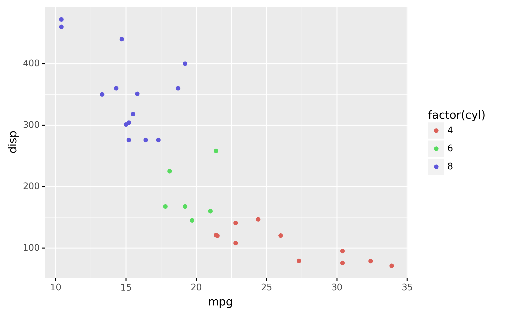
```
]
</div>

<div style="position: relative; top: 5px">
.pull-right[

#### Adicionando outros objetos geométricos

```{python, eval = FALSE}
(
  ggplot(mtcars, aes(x = 'mpg', y = 'disp', color = 'factor(cyl)'))
    + geom_point() + geom_line()
)
```

```{python, echo = FALSE}
save_ggplot_obj(
  (
    ggplot(mtcars, aes(x = 'mpg', y = 'disp', color = 'factor(cyl)'))
      + geom_point() + geom_line()
  ), 
  './images/python/v2021/ggplot_5.png' 
)
```

```{r fig70, echo=FALSE, out.height="85%", out.width="85%"}
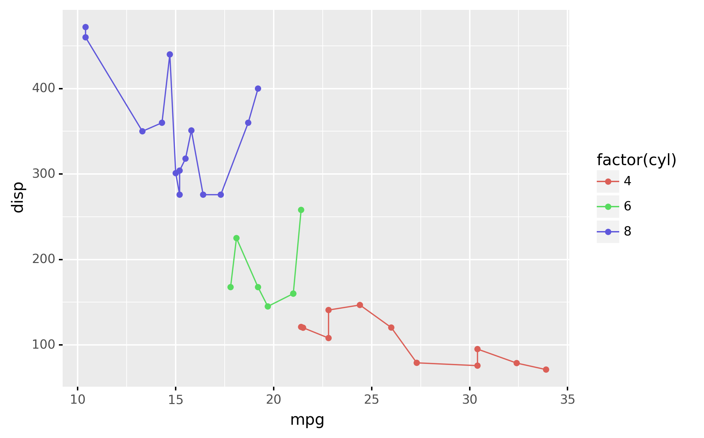
```
]
</div>

---
class: title-slide

<br><br><br><br>
# .center.font170[[Hands-on](https://www.kaggle.com/phelpsmemo/intro-ds-python-23-07) `r anicon::faa("hand-paper", animate = 'float', speed = 'slow')`]
